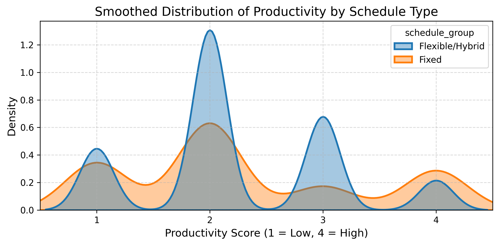
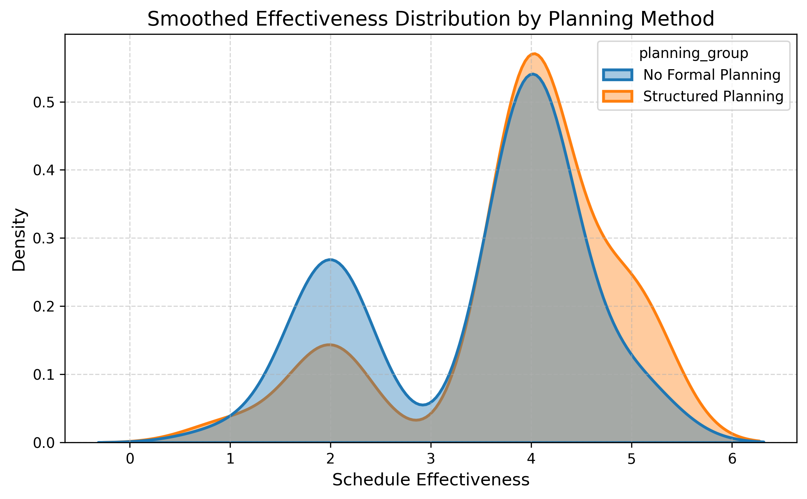
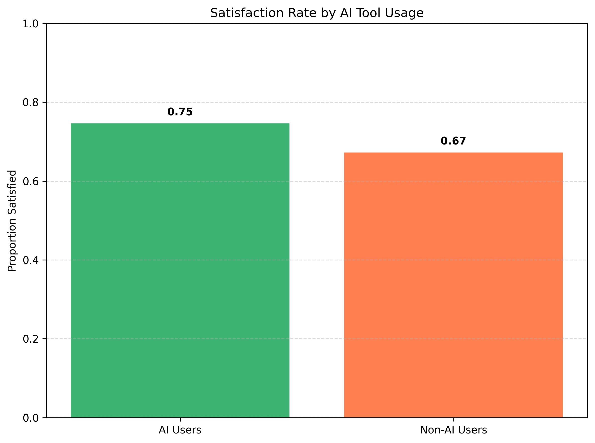

# 📊 Schedule Impact Statistical Analysis  
  

A statistical analysis exploring how different student scheduling styles — **Fixed**, **Flexible**, and **Hybrid** — influence key outcomes like productivity, satisfaction, planning effectiveness, and lifestyle habits.

---

## 🎯 Project Objective

To investigate the **impact of schedule types** on various factors like productivity, satisfaction, and health habits using student survey data. The project applies **statistical testing (T-tests)** and **data visualization** to uncover trends and actionable insights.

---

## 📁 Project Structure

```

schedule-impact-statistical-analysis/
│
├── schedule_analysis.ipynb       ← Main Colab notebook for all analysis
├── charts/                       ← Visual outputs
│   ├── demographics/
│   ├── observations/
│   └── conclusion/
├── data/
│   ├── schedule_survey_cleaned.xlsx
│   └── data_dictionary.md
├── summary_table.csv             ← Key findings summary
├── report/
│   └── schedule-impact-presentation.pdf
├── LICENSE
├── .gitignore
└── README.md

```

---

## 📈 Analysis Overview

- 🔍 **Data Collection**: Survey of students (N ≈ 150), aged 18–23  
- 🧪 **Methods Used**:  
  - Independent samples T-test  
  - KDE plots, histograms, bar charts  
  - Grouped statistical summaries  
- 📊 **Focus Areas**:  
  - Productivity  
  - Scheduling satisfaction & control  
  - Mental and physical well-being  
  - AI scheduling tool usage

---

## 📊 Key Visualizations

- **Demographics** → Age, Gender, Schedule Type Distributions  
- **Observations** → Productivity, Health, and Satisfaction vs. Schedule Type  
- **Conclusion** → Summarized insights and correlations

See charts in the [`/charts/`](charts/) folder.

---

## 🖼️ Sample Visuals

<p align="center">
  
  <br>
  <em>Fig 1: Productivity distribution across schedule types (Fixed vs. Flexible/Hybrid)</em>
</p>

<p align="center">
  
  <br>
  <em>Fig 2: Effectiveness score distribution for students using vs. not using planning tools</em>
</p>

<p align="center">
  
  <br>
  <em>Fig 3: Scheduling satisfaction among AI tool users vs. non-users</em>
</p>

<!-- --- -->

## 🧠 Key Insights

| # | Observation                      | Result                             | Significant? |
|---|----------------------------------|------------------------------------|--------------|
| 1 | Schedule Type vs. Productivity   | No clear difference                | ❌ No (p = 0.869) |
| 2 | Control vs. Satisfaction         | More control → Higher satisfaction | ✅ Yes (p = 0.0012) |
| 3 | Planning vs. Effectiveness       | Planned → More effective           | ✅ Yes (p = 0.0078) |
| 4 | Schedule vs. Healthy Lifestyle   | No significant relationship        | ❌ No (Z = 1.315) |
| 5 | AI Use vs. Satisfaction          | No clear impact observed           | ❌ No (Z = 1.037) |


🔗 Full summary in: [`summary_table.csv`](summary_table.csv)

---

## 💡 Recommendations

- Promote **flexible scheduling** in academic settings  
- Encourage **digital calendar use** and AI tools  
- Educate students on planning habits for better well-being

---

## 📝 How to Reproduce

1. Clone or fork this repository  
2. Open `schedule_analysis.ipynb` in [Google Colab](https://colab.research.google.com/drive/1tBq3Fz_Gdtlv7m1dR8UO_ghKibDGo2-m?usp=sharing)  
3. Ensure `data/schedule_survey_cleaned.xlsx` is available  
4. Run the notebook to regenerate analysis and charts

---

## 👨‍💻 Contributors

This project was collaboratively created by:

- **Fatima Mohsin** – [GitHub](https://github.com/fatimakhan579)  
- **Alveena Javed** – [GitHub](https://github.com/Alveena-Javaid)  
- **M. Obaid ur Rehman** – [GitHub](#)
- **M. Zohaib Khan** – [GitHub](https://github.com/ZohaibCodez) 

> *ℹ️ All members contributed equally to this project as part of a collaborative academic effort.*

---

## 📄 License

This project is open-sourced under the **MIT License** – see [LICENSE](LICENSE) for details.<br>
You are free to use, adapt, and distribute this work with attribution.

